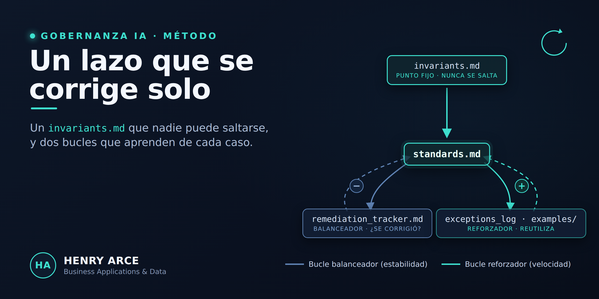
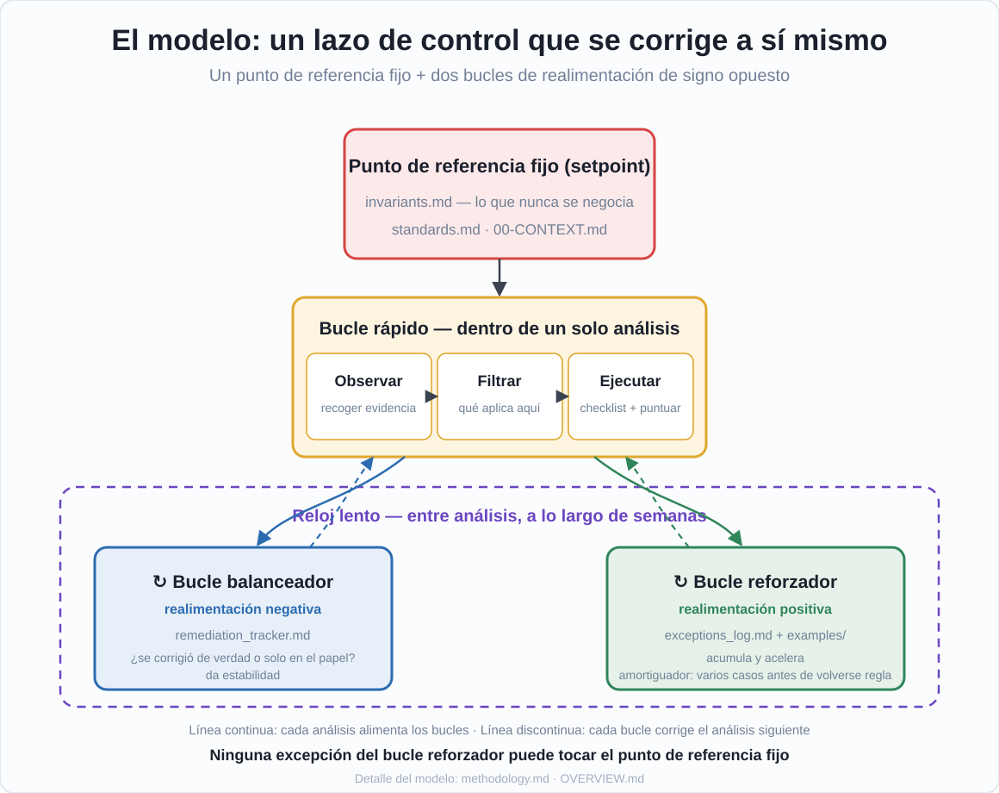

# Marco de Gobernanza de IA — v0.0

Plantilla reutilizable para que un equipo defina cómo se usa la IA (por ejemplo, Claude Code)
al revisar, auditar o construir proyectos, y qué reglas nunca se pueden saltar.

Es un **esqueleto**: está pensado para copiarse a un repositorio, rellenar los huecos
`[PENDIENTE]` con la realidad de cada empresa, y crecer caso a caso. No contiene datos de
ninguna organización concreta.

> **¿Por dónde empezar a leer?** [`OVERVIEW.md`](OVERVIEW.md) explica **qué es** el proyecto,
> **qué problema resuelve** y **cómo piensa** por dentro (el modelo de lazo de control del
> diagrama de arriba). Es la lectura de contexto; para el detalle operativo, cada archivo tiene
> lo suyo (ver la tabla de estructura).

## Cómo empezar

1. Copia esta carpeta a tu repositorio (o enlázala en `.claude/rules/`).
2. Rellena `00-CONTEXT.md` con los datos de tu empresa (los campos `[PENDIENTE]`).
3. Revisa `invariants.md` y `standards.md` y ajústalos si hace falta.
4. Usa los registros (`exceptions_log.md`, `remediation_tracker.md`, etc.) a medida que
   aparezcan casos reales.

## Estructura

| Archivo | Qué es |
|---|---|
| `OVERVIEW.md` | Documento base: qué es, qué problema resuelve y cómo piensa por dentro. |
| `CLAUDE.md` | Punto de entrada para la IA: qué leer y en qué orden. |
| `00-CONTEXT.md` | Datos de la empresa (sector, marca, responsables). Rellenar. |
| `invariants.md` | Reglas que **nunca** se pueden saltar, pase lo que pase. |
| `standards.md` | Checklist de cumplimiento (contextual, ajustable por proyecto). |
| `methodology.md` | El porqué de la estructura (opcional, contexto). |
| `exceptions_log.md` | Registro de excepciones concedidas. |
| `remediation_tracker.md` | Seguimiento de hallazgos hasta que se corrigen. |
| `prompt_changelog.md` | Historial de cambios de las reglas. |
| `tool_status.md` | Herramientas aprobadas / desaconsejadas / prohibidas. |
| `examples/` | Un caso resuelto por archivo, para no re-derivar desde cero. |
| `docu/` | Documentación de apoyo: arquitectura, ejemplos de invocación y el diagrama del modelo. |
| `.claude/` | Configuración de hooks de Claude Code (validaciones automáticas). |

## Estado

Versión 0.0 — esqueleto inicial. Ver `prompt_changelog.md` para el historial de cambios.

## Licencia

[PENDIENTE — p. ej. MIT, o uso interno]
